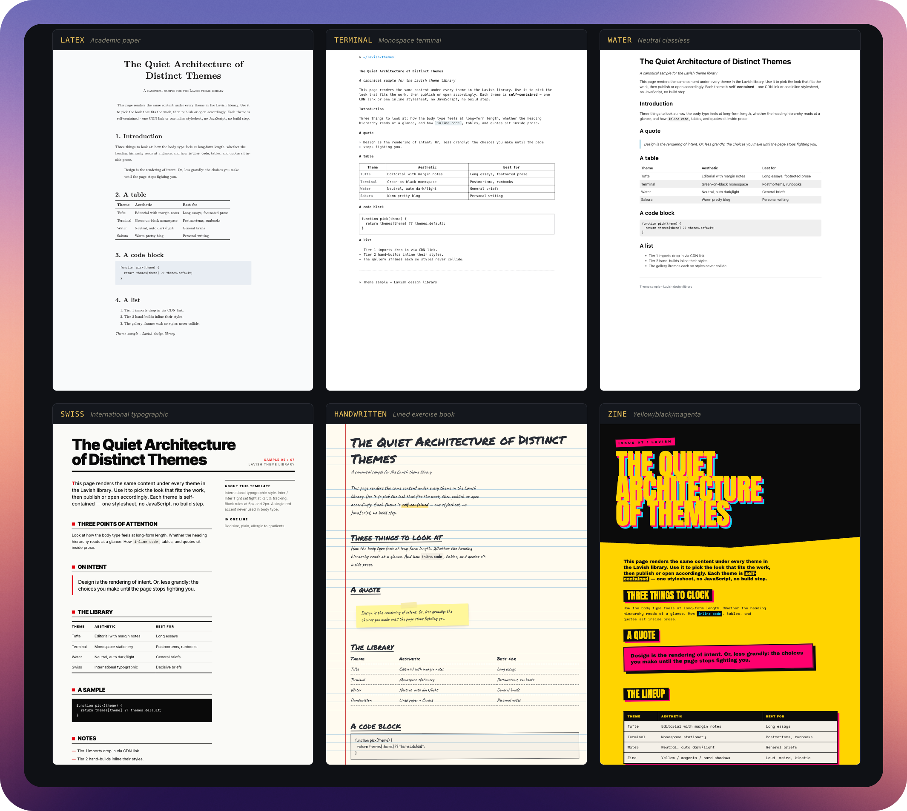

# Lavish Themes

Six self-contained HTML theme shells you can paste content into. No build step, no framework dependency at view time, no JavaScript. Open any file in a browser and it just renders.



Built for use with [`lavish-axi`](https://github.com/kunchenguid/lavish-axi) and the [`lavish-publish-cf`](https://github.com/natekettles/lavish-publish-cf) worker, but the themes themselves are framework-agnostic — a Claude Code agent, a static-site generator, or a human with a text editor can all use them the same way.

## The themes

### Tier 1 — vendored from upstream sources

CSS lives inline in each shell. No external CDN at view time. Refresh from upstream with `python3 _vendor_tier1.py`.

| Slug | Aesthetic | Best for | Vendored from |
| --- | --- | --- | --- |
| [`latex`](tier1/latex.html) | Academic paper, Latin Modern | Briefs that should feel like research | [latex.vercel.app](https://latex.vercel.app) + LM woff2 fonts base64-inlined |
| [`terminal`](tier1/terminal.html) | Monospace terminal stationery | Postmortems, runbooks, RFCs | [terminal.css@0.7.4](https://terminalcss.xyz) |
| [`water`](tier1/water.html) | Neutral classless, auto dark/light | General-purpose briefs | [water.css@2](https://watercss.kognise.dev) |

### Tier 2 — hand-built

Authored in this repo. Only external dependency is Google Fonts.

| Slug | Aesthetic | Best for |
| --- | --- | --- |
| [`swiss`](tier2/swiss.html) | International typographic. Inter Tight, black/red/white grid, flush-left. | Decisive product/strategy briefs |
| [`handwritten`](tier2/handwritten.html) | Lined exercise book + Caveat + Permanent Marker. Warm paper. | Personal notes, casual writing |
| [`zine`](tier2/zine.html) | Yellow / black / magenta. Anton display. Clip-path angles, hard shadows. | Loud manifestos, launches |

## Preview them

Open the gallery — every theme side-by-side, no server needed:

```sh
open _gallery.html      # macOS
xdg-open _gallery.html  # Linux
```

The gallery uses `<iframe srcdoc>` so each theme is inlined into one file. Works offline.

## Use a theme

```sh
cp tier2/swiss.html my-brief.html
# edit my-brief.html, replace the sample body content with yours
open my-brief.html
```

That's the whole flow. Each shell carries identical sample content so you can compare them apples-to-apples; when you adapt one, keep its structural markup (e.g. `latex` uses `<article>` wrapping) and replace the prose.

## Install

For ad-hoc use, `git clone` is enough.

For Claude Code agents (so the [`/publish`](https://github.com/natekettles/lavish-publish-cf) skill and any other lavish-aware agent can see the themes), run:

```sh
./scripts/install.sh
```

The script clones (or updates) this repo at `~/.lavish-themes`, optionally symlinks it into `~/.claude/skills/lavish-themes` for skill discovery, and prints the gallery path so you can preview.

## Build / maintenance

```sh
python3 _vendor_tier1.py     # refresh tier-1 vendored CSS from upstream
python3 _build_gallery.py    # regenerate _gallery.html from tier1/ + tier2/
```

Python 3.8+. No third-party packages.

To add a theme: drop the HTML into `tier1/` or `tier2/`, add a line to the `THEMES = [...]` list in `_build_gallery.py`, re-run the script.

## Conventions

- No JavaScript. Themes work with `script-src 'none'` CSPs (e.g. the strict CSP on the `lavish-publish-cf` worker).
- Tier 1 vendoring inlines the entire upstream stylesheet (and base64-inlined fonts where applicable) so themes work offline and CDN-free.
- Tier 2 only loads Google Fonts externally. Replace the `<link rel="stylesheet">` with an inlined `@font-face` declaration if you need fully offline behaviour.
- Every shell carries `<meta name="lavish-design" content="off">`. That tag tells `lavish-axi` not to inject its DaisyUI auto-styling on top — irrelevant if you're not using lavish-axi, harmless if you are.

## Related projects

- [`lavish-axi`](https://github.com/kunchenguid/lavish-axi) — the local editor / review surface. `lavish-axi <file.html>` opens a theme in a browser with feedback tooling around it.
- [`lavish-publish-cf`](https://github.com/natekettles/lavish-publish-cf) — self-hosted Cloudflare Worker that publishes themed HTML pages on your own domain. The `/publish` Claude skill there knows how to pick a theme from this library.

## Licence

Source in this repo is MIT — see [`LICENSE`](LICENSE).

Vendored upstream CSS in `tier1/*.html` is redistributed under the upstream authors' licences — see [`THIRD-PARTY-NOTICES.md`](THIRD-PARTY-NOTICES.md).
